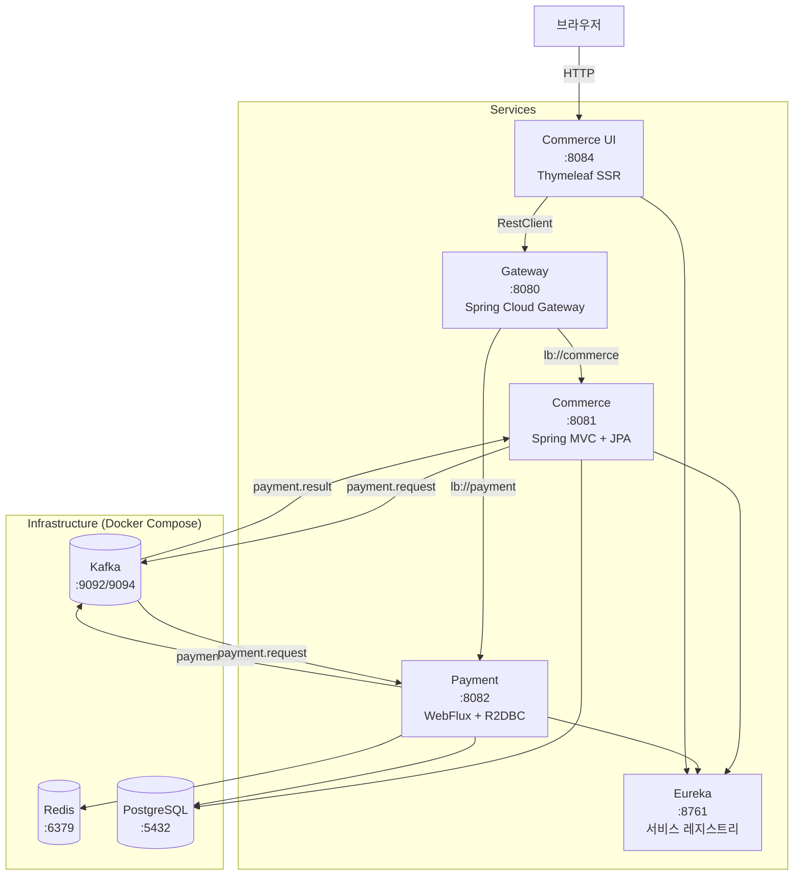
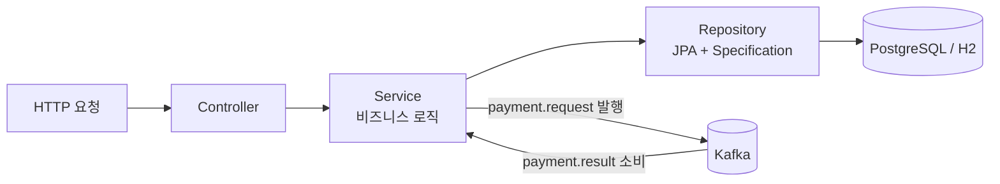
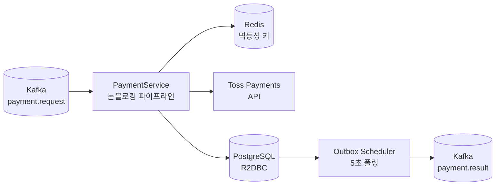
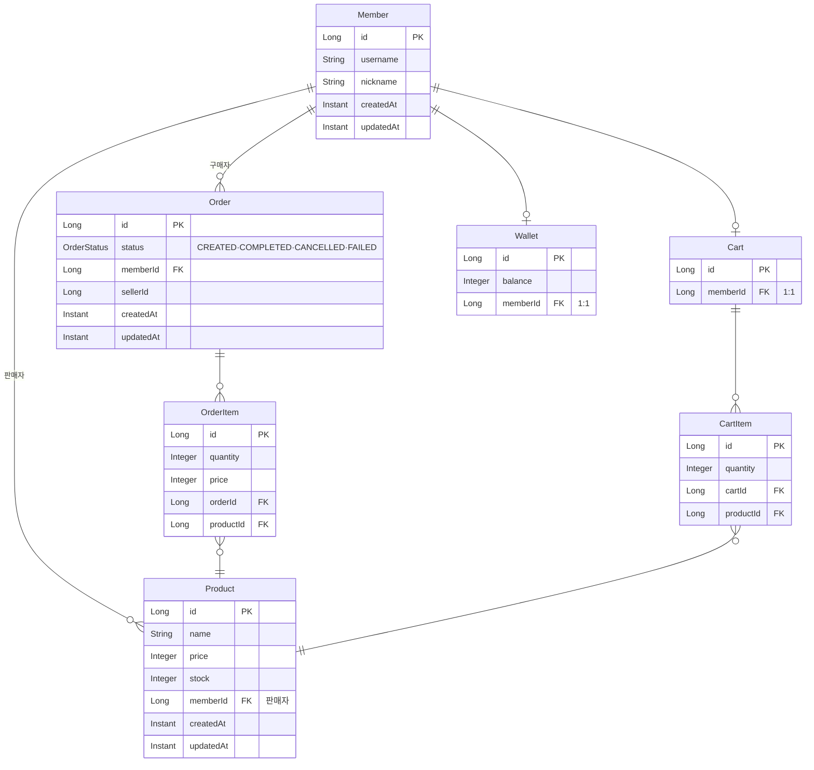

# Commerce Spring

마이크로서비스 기반 이커머스 플랫폼 백엔드

## 기술 스택

| 분류 | 기술 |
|---|---|
| Language | Java 21 |
| Framework | Spring Boot 4.0.3 / 4.0.4, Spring Cloud 2025.1.1 |
| Web | Spring MVC, Spring WebFlux |
| Data | Spring Data JPA, Spring Data R2DBC, PostgreSQL, H2 |
| Cache | Redis (Reactive) |
| Messaging | Apache Kafka |
| Service Mesh | Netflix Eureka, Spring Cloud Gateway |
| View | Thymeleaf |
| Build | Gradle |
| Infrastructure | Docker Compose |

---

## 아키텍처



---

## 서비스별 레이어 구조

### Commerce (Spring MVC + JPA)



| 레이어 | 위치 | 책임 |
|---|---|---|
| **Controller** | `controller/` | 요청 수신, DTO 변환, 응답 반환 |
| **Service** | `service/` | 비즈니스 로직, 트랜잭션, Kafka 이벤트 발행 |
| **Repository** | `repository/` | JPA 쿼리, Specification 동적 필터링 |
| **Domain** | `domain/` | 엔티티, 비즈니스 규칙 검증 |

### Payment (WebFlux + R2DBC)



| 레이어 | 위치 | 책임 |
|---|---|---|
| **Controller** | `controller/` | 결제 승인·취소·조회 REST API |
| **Service** | `service/` | 논블로킹 결제 파이프라인 |
| **Repository** | `repository/` | R2DBC 쿼리, Criteria 동적 필터 |
| **Event** | `event/` | OutboxScheduler, PaymentResultProducer |

---

## API 엔드포인트

### Commerce (:8081)

| Method | Path | 설명 |
|---|---|---|
| `POST` | `/members` | 회원 가입 |
| `GET` | `/members` | 회원 목록 (동적 필터) |
| `PUT` | `/members/{id}` | 회원 정보 수정 |
| `POST` | `/products` | 상품 등록 |
| `GET` | `/products` | 상품 목록 (동적 필터) |
| `GET` | `/products/{id}` | 상품 단건 조회 |
| `PUT` | `/products/{id}` | 상품 수정 |
| `POST` | `/orders` | 주문 생성 |
| `GET` | `/orders` | 주문 목록 (동적 필터) |
| `POST` | `/orders/{orderId}/cancel` | 주문 취소 |
| `POST` | `/carts` | 장바구니 담기 |
| `POST` | `/wallets` | 지갑 생성 |
| `GET` | `/wallets` | 지갑 조회 |
| `PATCH` | `/wallets/{id}/deposit` | 잔액 충전 |
| `PATCH` | `/wallets/{id}/withdraw` | 잔액 차감 |

### Payment (:8082)

| Method | Path | 설명 |
|---|---|---|
| `POST` | `/payments` | 결제 승인 (Toss Payments) |
| `POST` | `/payments/test-confirm` | 테스트 결제 승인 |
| `POST` | `/payments/refund` | 결제 취소·환불 |
| `GET` | `/payments` | 결제 목록 (동적 필터) |

---

## 도메인 모델



---

## 핵심 구현

### Transactional Outbox (Payment)

결제 처리 결과 DB 저장과 Kafka 발행은 단일 트랜잭션으로 묶을 수 없습니다. `payment` 테이블 저장과 동일한 트랜잭션에서 `outbox` 테이블에 레코드를 삽입하고, `OutboxScheduler`가 5초 주기로 `PENDING` 레코드를 폴링해 `payment.result` 토픽에 발행합니다.

### Pessimistic Lock + productId 오름차순 정렬 (Commerce)

복수 상품 주문 시 트랜잭션 간 역방향 락 획득으로 데드락이 발생합니다. `productId` 오름차순으로 락 획득 순서를 고정해 순환 대기 조건을 제거합니다. `@Retryable`(3회, 100ms 지수 백오프)로 `PessimisticLockingFailureException`을 재시도합니다.

### Redis 멱등성 (Payment)

Kafka at-least-once 특성으로 동일 메시지가 중복 소비될 수 있습니다. `setIfAbsent(LOCK_PREFIX + orderId, ...)` TTL 10분으로 처리 여부를 기록하고, 중복 요청을 즉시 스킵합니다.

### WebFlux + R2DBC 전 구간 논블로킹 (Payment)

Redis 조회 → Toss API 호출 → DB 저장이 연속되는 I/O 집약 작업을 전 구간 논블로킹으로 구성합니다. BlockHound로 테스트 시 블로킹 호출을 검증합니다.

### StringSerializer + 수동 ObjectMapper (Kafka)

`JsonSerializer`는 `__TypeId__` 헤더에 클래스 전체 경로를 삽입해 서비스 간 역직렬화가 실패합니다. 전 서비스를 `StringSerializer` + `ObjectMapper` 수동 직렬화로 통일합니다.

### JPA Specification 동적 필터링 (Commerce)

`MemberSpecification`, `ProductSpecification`, `OrderSpecification`, `WalletSpecification`으로 아이디·닉네임 / 가격·재고 범위 등 다양한 조건을 런타임에 조합합니다.

---

## 실행

### 요구사항

- Java 21
- Docker & Docker Compose

### 1. 인프라 실행

```bash
cd docker
docker-compose up -d   # Redis:6379, PostgreSQL:5432, Kafka:9092/9094
```

### 2. 서비스 빌드 및 실행

서비스 시작 순서: **eureka → gateway → commerce / payment → commerce-ui**

```bash
# 각 서비스 디렉터리에서 실행
cd <service-dir>
./gradlew bootJar
java -jar build/libs/*.jar
```

### 환경변수

| 변수 | 사용 서비스 | 기본값 |
|---|---|---|
| `DB_HOST` / `DB_PORT` | commerce, payment | localhost / 5432 |
| `KAFKA_HOST` | commerce, payment | localhost |
| `REDIS_HOST` | payment | localhost |
| `EUREKA_HOST` / `EUREKA_PORT` | 전 서비스 | localhost / 8761 |
| `SECRET_KEY` | payment, commerce-ui | Toss API 시크릿 키 |
| `CLIENT_KEY` | commerce-ui | Toss API 클라이언트 키 |

> 기본값은 H2 인메모리 DB(`ddl-auto: create-drop`)를 사용합니다. PostgreSQL 사용 시 `DB_HOST`, `DB_PORT`를 설정하세요.

---

## 프로젝트 구조

```
commerce-spring/
├── docker/                             # Docker Compose (Redis, PostgreSQL, Kafka)
├── eureka/                             # Netflix Eureka Server (:8761)
├── gateway/                            # Spring Cloud Gateway (:8080)
│
├── commerce/                           # 상품·회원·주문 서비스 (:8081)
│   └── src/main/java/com/commerce/
│       ├── config/                     # JpaConfig, RetryConfig
│       ├── controller/                 # Cart·Member·Order·Product·WalletController
│       ├── domain/                     # Cart, CartItem, Member, Order, OrderItem, Product, Wallet
│       ├── dto/                        # Request / Response 레코드
│       ├── event/                      # PaymentRequestEvent, PaymentResultConsumer
│       ├── exception/                  # ErrorCode, GlobalExceptionHandler, 도메인 예외
│       ├── repository/                 # JPA Repository + Specification (동적 필터)
│       └── service/                    # Cart·Member·Order·Product·WalletService
│
├── payment/                            # 결제 서비스 (:8082)
│   └── src/main/java/com/payment/
│       ├── config/                     # TossPaymentClient, TossPaymentConfig
│       ├── controller/                 # PaymentController
│       ├── domain/                     # Payment, Outbox (R2DBC 엔티티)
│       ├── dto/                        # Request / Response 레코드
│       ├── event/                      # OutboxScheduler, PaymentResultProducer
│       ├── exception/                  # ErrorCode, GlobalExceptionHandler, 도메인 예외
│       ├── repository/                 # R2DBC Repository + PaymentCriteria
│       ├── service/                    # PaymentService (논블로킹 파이프라인)
│       └── validation/                 # @ValidDateRange 커스텀 제약
│
└── commerce-ui/                        # 웹 UI 서비스 (:8084)
    └── src/main/java/com/commerce/ui/
        ├── client/                     # Member·Order·Payment·ProductClient (RestClient)
        ├── config/                     # RestClientConfig
        ├── controller/                 # Home·Member·Order·Payment·ProductController
        └── dto/                        # UI 전용 Request / Response DTO
```
