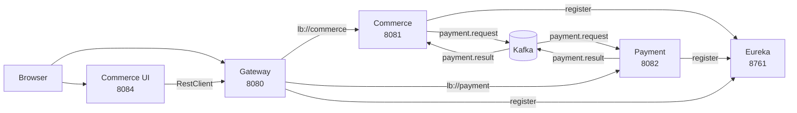

# Commerce Spring

마이크로서비스 기반 이커머스 플랫폼 백엔드

---

## 기술 스택

| 분류 | 기술 |
|---|---|
| Language | Java 21 |
| Framework | Spring Boot 4.0.3 / 4.0.4, Spring Cloud 2025.1.1 |
| Web | Spring MVC, Spring WebFlux |
| Data | Spring Data JPA, Spring Data R2DBC, PostgreSQL, H2 |
| Cache | Redis (Reactive) |
| Messaging | Apache Kafka |
| Service Mesh | Netflix Eureka, Spring Cloud Gateway |
| View | Thymeleaf |
| Build | Gradle |
| Infrastructure | Docker Compose |

---

## 서비스 구성

| 서비스 | 포트 | 역할 |
|---|---|---|
| `eureka` | 8761 | 서비스 레지스트리 |
| `gateway` | 8080 | API 라우팅 (lb://commerce, lb://payment) |
| `commerce` | 8081 | 회원 · 상품 · 주문 · 장바구니 · 지갑 |
| `payment` | 8082 | 결제 처리 (Toss Payments) |
| `commerce-ui` | 8084 | 서버사이드 렌더링 웹 UI |

---

## 아키텍처



---

## 핵심 구현

**Commerce**
- JPA Specification 기반 동적 필터링 (회원, 상품, 주문)
- 비관적 락(`PESSIMISTIC_WRITE`) + productId 정렬로 재고 데드락 방지
- `@Retryable`로 락 실패 자동 재시도 (3회, 100ms 지수 백오프)
- Transactional Outbox 패턴으로 주문 저장 ↔ Kafka 발행 원자성 보장
- 쿠폰 (리딤 코드 기반 발급 · 주문 시 할인 적용)

**Payment**
- WebFlux + R2DBC + Reactive Redis — 전 구간 논블로킹
- Redis `setIfAbsent`로 중복 결제 차단 (TTL 10분)
- Toss Payments 승인 · 취소 API 연동

**Commerce UI**
- Thymeleaf 서버사이드 렌더링
- RestClient로 Gateway 경유 API 호출
- Toss Payments 클라이언트 위젯 연동

---

## 기술적 의사결정

### Transactional Outbox
주문 DB 저장과 Kafka 발행은 단일 트랜잭션으로 묶을 수 없습니다. `outbox` 테이블에 주문 저장과 함께 레코드를 삽입(동일 트랜잭션)하고, 5초 주기 스케줄러가 `PENDING` 레코드를 폴링해 Kafka에 발행합니다.

### WebFlux + R2DBC (Payment)
결제는 Redis 조회 → 외부 API 호출 → DB 저장이 연속되는 I/O 집약 작업입니다. 전 구간 논블로킹으로 구성해 스레드 고갈 없이 높은 동시성을 처리합니다. BlockHound로 테스트 시 블로킹 호출을 검증합니다.

### Pessimistic Lock + productId 정렬
복수 상품 주문 시 트랜잭션 간 역방향 락 획득으로 데드락이 발생합니다. productId 오름차순으로 락 순서를 고정해 순환 대기 조건을 제거했습니다.

### Redis 멱등성
Kafka at-least-once 특성으로 동일 메시지가 중복 소비될 수 있습니다. `orderId`를 키로 Redis에 처리 여부를 기록하고, 중복 요청을 즉시 스킵합니다.

### StringSerializer + 수동 ObjectMapper
`JsonSerializer`는 `__TypeId__` 헤더에 클래스 전체 경로를 삽입해 서비스 간 역직렬화가 실패합니다. 전 서비스를 `StringSerializer` + `ObjectMapper` 수동 직렬화로 통일했습니다.

---

## 실행

```bash
# 인프라 (Redis, PostgreSQL, Kafka)
cd docker && docker-compose up -d

# 각 서비스 빌드 후 실행 순서
# eureka → gateway → commerce / payment → commerce-ui
./gradlew bootJar
java -jar build/libs/*.jar
```

| 환경변수 | 기본값 |
|---|---|
| `DB_HOST` / `DB_PORT` | localhost / 5432 |
| `KAFKA_HOST` | localhost |
| `REDIS_HOST` | localhost |
| `EUREKA_HOST` / `EUREKA_PORT` | localhost / 8761 |
| `SECRET_KEY` / `CLIENT_KEY` | Toss API 키 |
