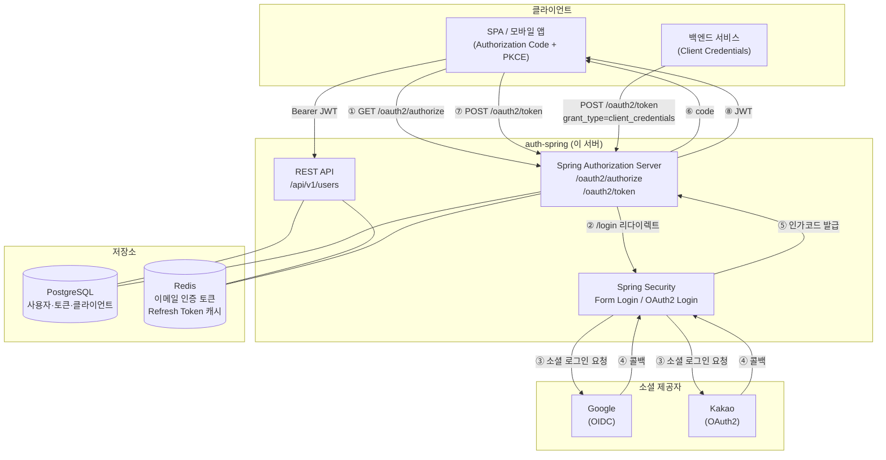
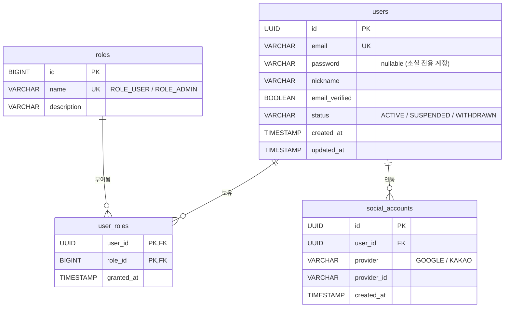
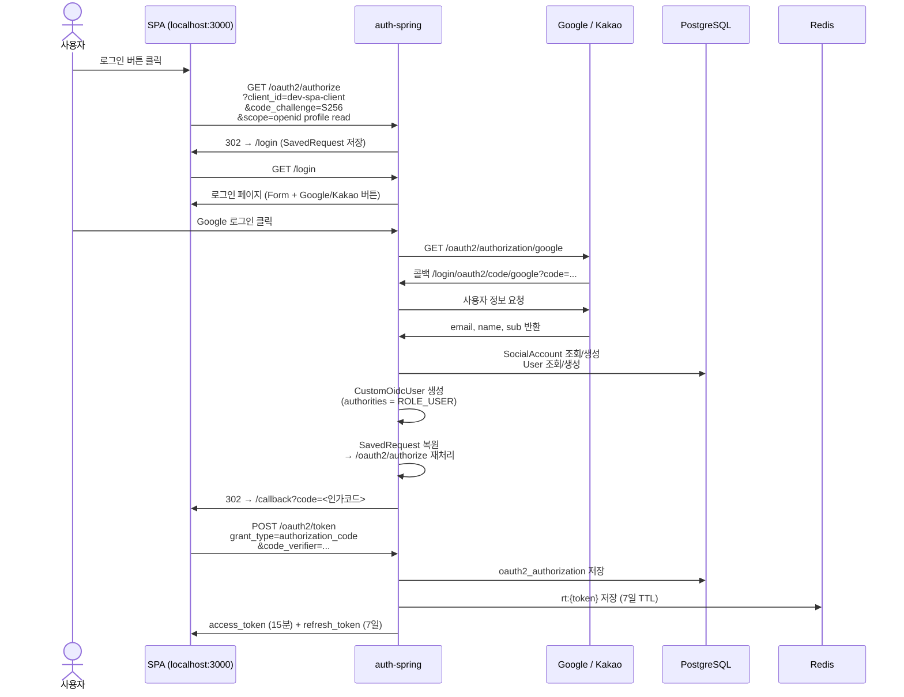
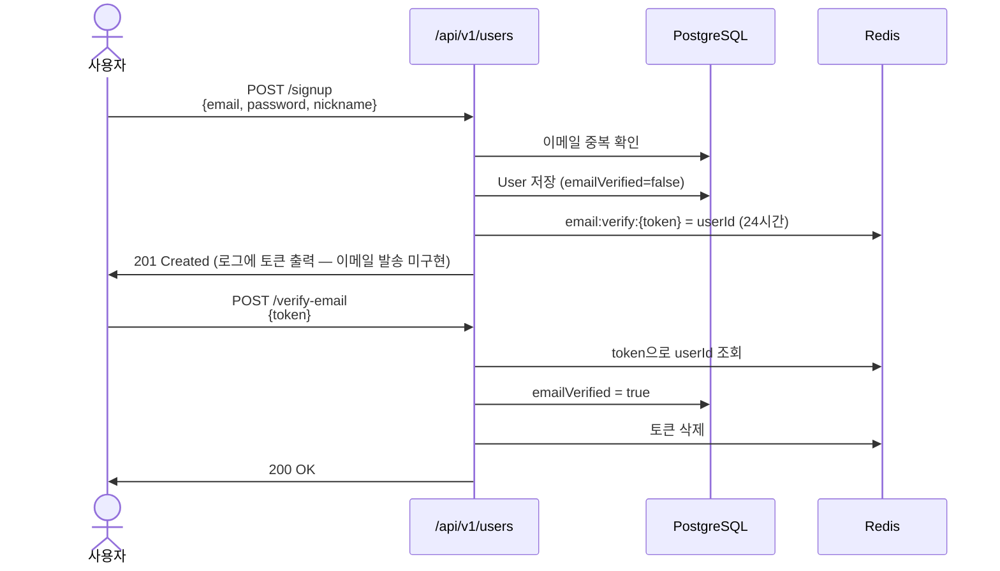
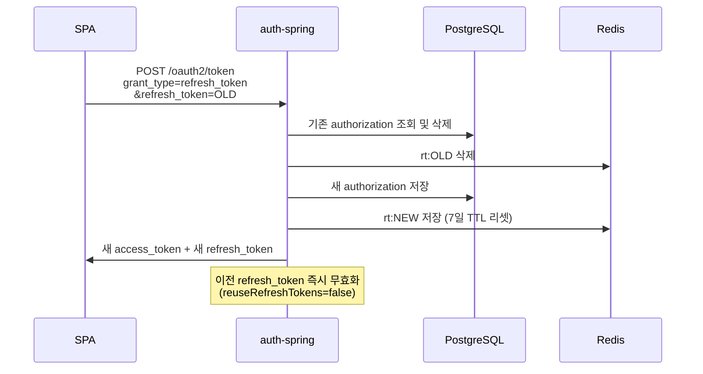
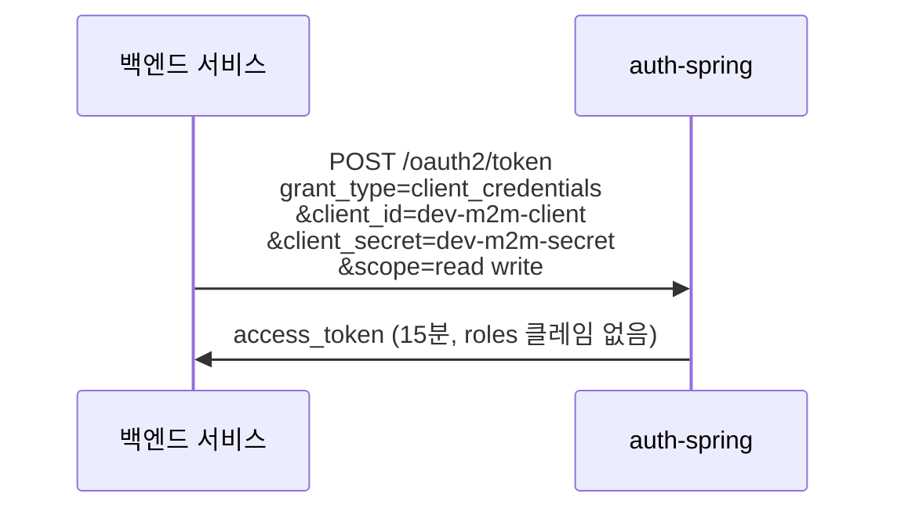
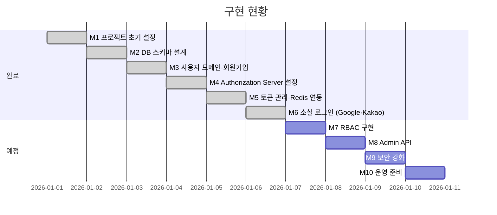

# auth-spring

Spring Boot 기반 OAuth2 인증 서버. Google·Kakao 소셜 로그인을 지원하며, Authorization Code + PKCE 및 Client Credentials 흐름을 제공합니다.

---

## 목차

1. [시스템 아키텍처](#시스템-아키텍처)
2. [기술 스택](#기술-스택)
3. [데이터베이스 구조](#데이터베이스-구조)
4. [인증 흐름](#인증-흐름)
5. [API 명세](#api-명세)
6. [마일스톤별 구현 현황](#마일스톤별-구현-현황)
7. [로컬 실행 방법](#로컬-실행-방법)

---

## 시스템 아키텍처



---

## 기술 스택

| 분류 | 기술 | 버전 |
|---|---|---|
| 언어 | Java | 21 |
| 프레임워크 | Spring Boot | 4.0.5 |
| 인증 | Spring Authorization Server | (Boot BOM) |
| 소셜 로그인 | Spring OAuth2 Client | (Boot BOM) |
| ORM | Spring Data JPA + Hibernate | (Boot BOM) |
| DB 마이그레이션 | Flyway | (Boot BOM) |
| 캐시 | Spring Data Redis | (Boot BOM) |
| DB (운영) | PostgreSQL | (Boot BOM) |
| DB (개발/테스트) | H2 (in-memory) | (Boot BOM) |
| API 문서 | SpringDoc OpenAPI | 3.0.2 |
| 모니터링 | Micrometer + Prometheus | (Boot BOM) |
| 빌드 | Gradle | - |

---

## 데이터베이스 구조

### 도메인 테이블 (V1 마이그레이션)



### OAuth2 서버 테이블 (V2 마이그레이션 — Spring Authorization Server 표준)

| 테이블 | 용도 |
|---|---|
| `oauth2_registered_client` | 등록된 OAuth2 클라이언트 |
| `oauth2_authorization` | 인가 상태 (code, access/refresh token) |
| `oauth2_authorization_consent` | 사용자 동의 내역 |

### 기본 데이터 (V3 마이그레이션)

| 역할 | 설명 |
|---|---|
| `ROLE_USER` | 일반 사용자 |
| `ROLE_ADMIN` | 관리자 |

---

## 인증 흐름

### 1. 소셜 로그인 → Authorization Code + PKCE (SPA 대상)



### 2. 이메일/비밀번호 회원가입 → 이메일 인증



### 3. Refresh Token 갱신 (토큰 회전)



### 4. M2M 서비스 간 통신 (Client Credentials)



---

## API 명세

### 공개 엔드포인트 (인증 불필요)

| 메서드 | 경로 | 설명 |
|---|---|---|
| `POST` | `/api/v1/users/signup` | 회원가입 |
| `POST` | `/api/v1/users/verify-email` | 이메일 인증 |
| `GET` | `/actuator/health` | 헬스 체크 |
| `GET` | `/actuator/info` | 앱 정보 |

### 인증 필요 엔드포인트 (Bearer JWT)

| 메서드 | 경로 | 권한 | 설명 |
|---|---|---|---|
| `GET` | `/api/v1/users/me` | `ROLE_USER` | 내 정보 조회 |
| `PATCH` | `/api/v1/users/me` | `ROLE_USER` | 닉네임 수정 |
| `DELETE` | `/api/v1/users/me` | `ROLE_USER` | 회원 탈퇴 |

### Authorization Server 엔드포인트 (Spring 표준)

| 경로 | 설명 |
|---|---|
| `GET /oauth2/authorize` | 인가 요청 |
| `POST /oauth2/token` | 토큰 발급 / 갱신 |
| `GET /oauth2/jwks` | JWK 공개키 |
| `GET /.well-known/openid-configuration` | OIDC Discovery |
| `POST /oauth2/revoke` | 토큰 폐기 |

### 개발 도구

| 경로 | 설명 |
|---|---|
| `/swagger-ui.html` | API 문서 |
| `/h2-console` | DB 콘솔 (local 프로파일) |
| `/actuator/prometheus` | Prometheus 메트릭 |

---

## 마일스톤별 구현 현황



### M1 — 프로젝트 초기 설정 ✅

- Spring Boot 4.0.5 / Java 21 Gradle 프로젝트
- 도메인 기반 패키지 구조 (`user`, `token`, `client`, `config`)
- 공통 응답 포맷 `ApiResponse<T>`, 에러 코드 enum, `GlobalExceptionHandler`
- Spring Profile 분리 (`local` / `prod`)

### M2 — 데이터베이스 스키마 ✅

- Flyway 마이그레이션 3개 적용
- `users`, `social_accounts`, `roles`, `user_roles` 테이블
- Spring Authorization Server 표준 테이블 3개
- 기본 역할 `ROLE_USER`, `ROLE_ADMIN` 시드 데이터

### M3 — 사용자 도메인 ✅

- 회원가입 (`POST /api/v1/users/signup`) — 이메일 중복 확인, 비밀번호 BCrypt 암호화
- 이메일 인증 (`POST /api/v1/users/verify-email`) — Redis TTL 24시간 토큰
- 내 정보 조회·닉네임 수정·회원 탈퇴 (`/api/v1/users/me`)
- `UserDetailsServiceImpl` — Form Login용 사용자 로드
- ⚠️ **이메일 발송 미구현** — 현재 토큰을 서버 로그로 출력 (TODO 주석 존재)

### M4 — Authorization Server 설정 ✅

- `AuthorizationServerConfigurer` 설정, OIDC Discovery 활성화
- RSA-2048 JWK 키쌍 (현재 인메모리 생성 — 재시작 시 갱신됨)
- JWT `roles` 클레임 커스터마이징 (`tokenCustomizer`)
- `JdbcRegisteredClientRepository` — DB 기반 클라이언트 관리
- 개발용 클라이언트 자동 등록 (`DevDataInitializer`, `local` 프로파일):
  - `dev-spa-client` — Authorization Code + PKCE, 공개 클라이언트
  - `dev-m2m-client` — Client Credentials, 비밀 클라이언트

### M5 — 토큰 관리 ✅

- Refresh Token 회전 (`reuseRefreshTokens=false`)
- `TokenAwareOAuth2AuthorizationService` — JDBC 저장 + Redis 동기화 데코레이터
- `RefreshTokenRedisRepository` — `rt:{token}` 키, 7일 TTL
- Access Token 15분 / Refresh Token 7일

### M6 — 소셜 로그인 ✅

- Google OIDC 로그인 (`CustomOidcUserService`)
- Kakao OAuth2 로그인 (`CustomOAuth2UserService`)
- 소셜 계정 연동 3단계 전략 (`SocialUserRegistrationService`):
  1. `provider + providerId` → 기존 계정 반환
  2. 동일 이메일 기존 계정 → 소셜 계정 연동
  3. 신규 계정 생성 (`emailVerified=true` 자동 설정)
- `SecurityConfig` — `oauth2Login` 통합, 로그인 성공 후 `/swagger-ui.html` 폴백

---

### M7 — RBAC 구현 🔲 예정

- 역할 기반 세분화 권한 체계
- `@PreAuthorize` 확장 적용

### M8 — Admin API 🔲 예정

- OAuth2 클라이언트 등록·수정·삭제 API
- 사용자 목록 조회·역할 변경·계정 정지 API

### M9 — 보안 강화 🔲 예정

- 로그인 실패 횟수 초과 계정 잠금 (`ACCOUNT_LOCKED`)
- 토큰 폐기 API (`/oauth2/revoke` 확장)

### M10 — 운영 준비 🔲 예정

- RSA 키페어 외부 주입 (환경변수 / Vault)
- PostgreSQL 운영 환경 설정 (`prod` 프로파일)
- Docker / 컨테이너 배포 구성

---

## 로컬 실행 방법

### 사전 조건

```bash
# Redis 실행
docker run -d -p 6379:6379 redis
```

소셜 로그인을 사용하려면 각 플랫폼에서 OAuth2 앱을 등록하고 콜백 URI를 추가해야 합니다.

| 제공자 | 콜백 URI |
|---|---|
| Google | `http://localhost:8080/login/oauth2/code/google` |
| Kakao | `http://localhost:8080/login/oauth2/code/kakao` |

### 환경변수 설정 (선택 — 소셜 로그인 필요 시)

```bash
export GOOGLE_CLIENT_ID=<Google Cloud Console 발급>
export GOOGLE_CLIENT_SECRET=<Google Cloud Console 발급>
export KAKAO_CLIENT_ID=<카카오 개발자 콘솔 발급>
```

### 실행

```bash
# 빌드
./gradlew build

# 로컬 실행
./gradlew bootRun --args='--spring.profiles.active=local'

# 테스트
./gradlew test
```

### 접속 정보

| 항목 | 주소 |
|---|---|
| API 문서 | http://localhost:8080/swagger-ui.html |
| H2 콘솔 | http://localhost:8080/h2-console |
| OIDC Discovery | http://localhost:8080/.well-known/openid-configuration |
| 헬스 체크 | http://localhost:8080/actuator/health |
