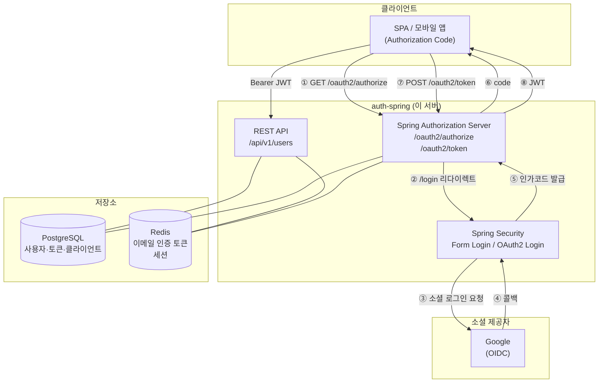
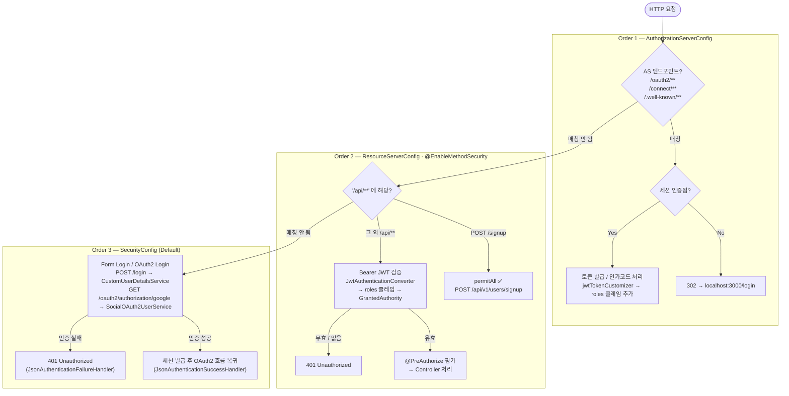
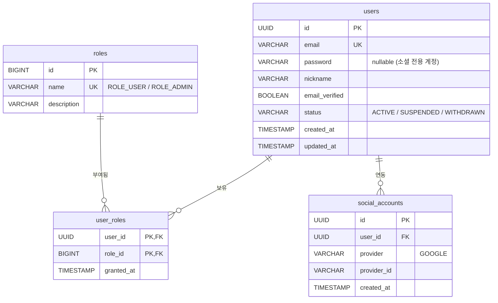
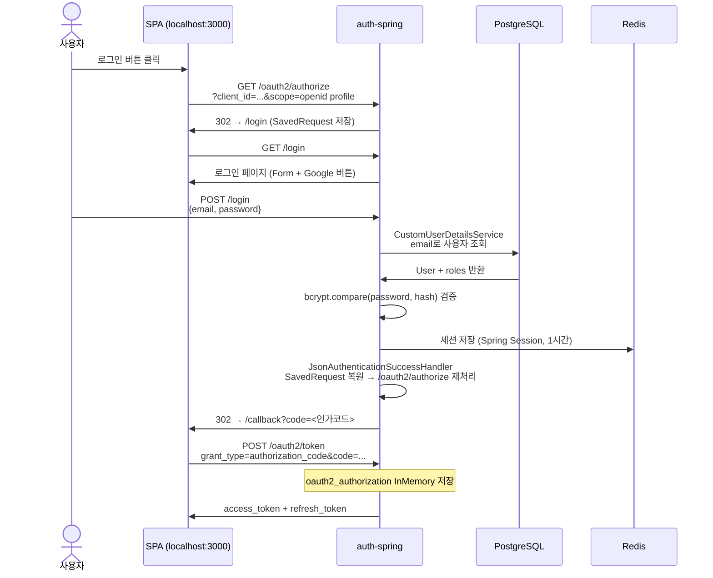
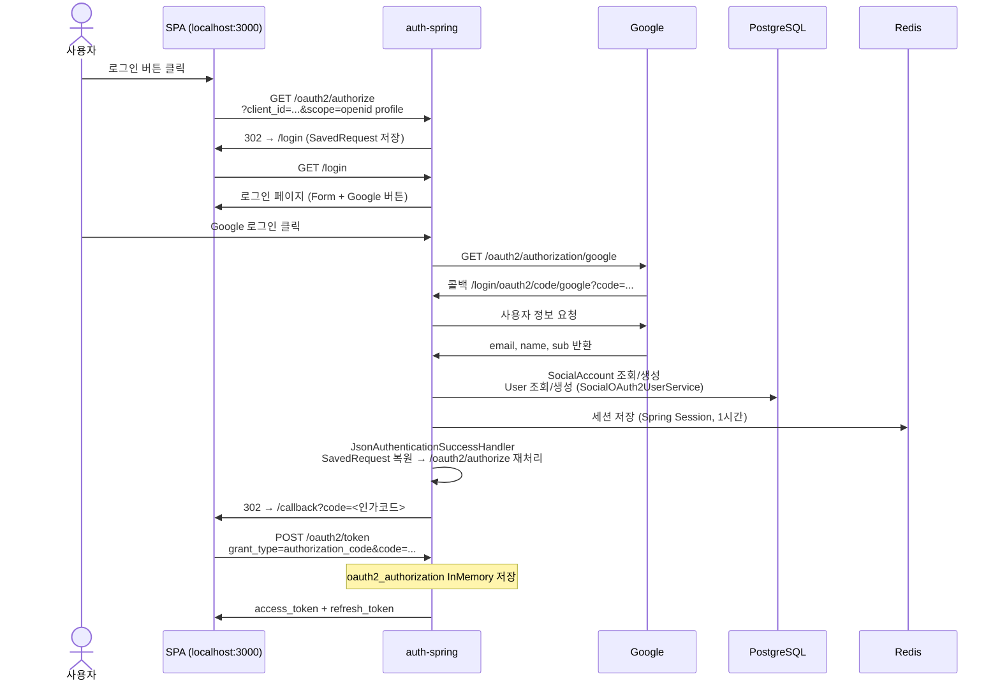
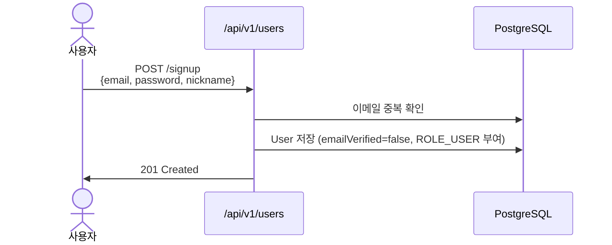

# auth-spring

Spring Boot 기반 OAuth2 인증 서버. Google 소셜 로그인을 지원하며, Authorization Code 흐름을 제공합니다.

---

## 목차

1. [시스템 아키텍처](#시스템-아키텍처)
2. [SecurityFilter Chain](#securityfilter-chain)
3. [기술 스택](#기술-스택)
4. [데이터베이스 구조](#데이터베이스-구조)
5. [인증 흐름](#인증-흐름)
6. [API 명세](#api-명세)
7. [로컬 실행 방법](#로컬-실행-방법)

---

## 시스템 아키텍처



---

## SecurityFilter Chain

Spring Security는 요청이 들어오면 **Order 순서대로** 각 FilterChain의 `securityMatcher`를 확인하여, 처음으로 매칭되는 체인 하나만 적용합니다.



### 요청별 담당 체인 요약

| 요청 | 체인 | 인증 방식 |
|---|---|---|
| `GET /oauth2/authorize` | Order 1 (AS) | 세션 — 미인증 시 `/login` 리다이렉트 |
| `POST /oauth2/token` | Order 1 (AS) | Client Basic Auth |
| `GET /oauth2/jwks` | Order 1 (AS) | 공개 엔드포인트 |
| `POST /api/v1/users/signup` | Order 2 (RS) | permitAll |
| `GET /api/v1/users/me` | Order 2 (RS) | Bearer JWT + `ROLE_USER` |
| `POST /login` | Order 3 (Default) | Form Login (ID/PW) |
| `GET /oauth2/authorization/google` | Order 3 (Default) | OAuth2 소셜 로그인 (Google) |
| `GET /login/oauth2/code/google` | Order 3 (Default) | Google 콜백 처리 |

---

## 기술 스택

| 분류 | 기술 | 버전 |
|---|---|---|
| 언어 | Java | 21 |
| 프레임워크 | Spring Boot | 4.0.5 |
| 인증 | Spring Authorization Server | (Boot BOM) |
| 소셜 로그인 | Spring OAuth2 Client | (Boot BOM) |
| ORM | Spring Data JPA + Hibernate | (Boot BOM) |
| DB 마이그레이션 | Flyway | (Boot BOM) |
| 캐시 / 세션 | Spring Data Redis, Spring Session | (Boot BOM) |
| DB (운영) | PostgreSQL | (Boot BOM) |
| DB (개발/테스트) | H2 (in-memory) | (Boot BOM) |
| API 문서 | SpringDoc OpenAPI | 3.0.2 |
| 모니터링 | Micrometer + Prometheus | (Boot BOM) |
| 빌드 | Gradle | - |

---

## 데이터베이스 구조

### 도메인 테이블 (V1 마이그레이션)



### OAuth2 서버 테이블 (V2 마이그레이션 — Spring Authorization Server 표준)

| 테이블 | 용도 |
|---|---|
| `oauth2_registered_client` | 등록된 OAuth2 클라이언트 |
| `oauth2_authorization` | 인가 상태 (code, access/refresh token) |
| `oauth2_authorization_consent` | 사용자 동의 내역 |

### 기본 데이터 (V3 마이그레이션)

| 역할 | 설명 |
|---|---|
| `ROLE_USER` | 일반 사용자 |
| `ROLE_ADMIN` | 관리자 |

---

## 인증 흐름

### 1. 이메일/비밀번호 로그인 → Authorization Code (SPA 대상)



### 2. 소셜 로그인 → Authorization Code (SPA 대상)



### 3. 이메일/비밀번호 회원가입

> ⚠️ 이메일 인증(`POST /api/v1/users/verify-email`)은 미구현 상태입니다. Redis 토큰 저장 및 발송 코드가 주석 처리되어 있어 항상 `T001 INVALID_TOKEN` 에러를 반환합니다.



---

## API 명세

### 공개 엔드포인트 (인증 불필요)

| 메서드 | 경로 | 설명 |
|---|---|---|
| `POST` | `/api/v1/users/signup` | 회원가입 |
| `GET` | `/actuator/health` | 헬스 체크 |
| `GET` | `/actuator/info` | 앱 정보 |

### 인증 필요 엔드포인트 (Bearer JWT)

| 메서드 | 경로 | 권한 | 설명 |
|---|---|---|---|
| `POST` | `/api/v1/users/verify-email` | JWT 필요 | 이메일 인증 토큰 확인 |
| `GET` | `/api/v1/users/me` | `ROLE_USER` | 내 정보 조회 |
| `PATCH` | `/api/v1/users/me` | `ROLE_USER` | 닉네임 수정 |
| `DELETE` | `/api/v1/users/me` | `ROLE_USER` | 회원 탈퇴 |

### Authorization Server 엔드포인트 (Spring 표준)

| 경로 | 설명 |
|---|---|
| `GET /oauth2/authorize` | 인가 요청 |
| `POST /oauth2/token` | 토큰 발급 / 갱신 |
| `GET /oauth2/jwks` | JWK 공개키 |
| `GET /.well-known/openid-configuration` | OIDC Discovery |
| `POST /oauth2/revoke` | 토큰 폐기 |

### 개발 도구

| 경로 | 설명 |
|---|---|
| `/swagger-ui.html` | API 문서 |
| `/h2-console` | DB 콘솔 (local 프로파일) |
| `/actuator/prometheus` | Prometheus 메트릭 |

---

## 로컬 실행 방법

### 사전 조건

```bash
# Redis 실행
docker run -d -p 6379:6379 redis
```

소셜 로그인을 사용하려면 각 플랫폼에서 OAuth2 앱을 등록하고 콜백 URI를 추가해야 합니다.

| 제공자 | 콜백 URI |
|---|---|
| Google | `http://localhost:8080/login/oauth2/code/google` |

### 환경변수 설정 (선택 — 소셜 로그인 필요 시)

```bash
export GOOGLE_CLIENT_ID=<Google Cloud Console 발급>
export GOOGLE_CLIENT_SECRET=<Google Cloud Console 발급>
```

### 실행

```bash
# 빌드
./gradlew build

# 로컬 실행
./gradlew bootRun --args='--spring.profiles.active=local'

# 테스트
./gradlew test
```

### 접속 정보

| 항목 | 주소 |
|---|---|
| API 문서 | http://localhost:8080/swagger-ui.html |
| H2 콘솔 | http://localhost:8080/h2-console |
| OIDC Discovery | http://localhost:8080/.well-known/openid-configuration |
| 헬스 체크 | http://localhost:8080/actuator/health |
