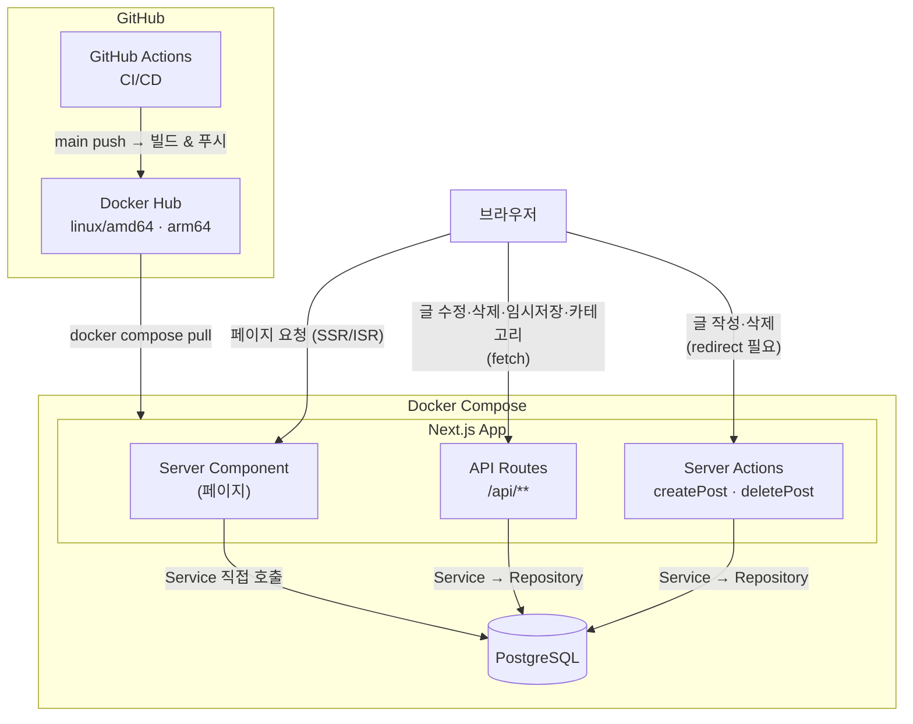
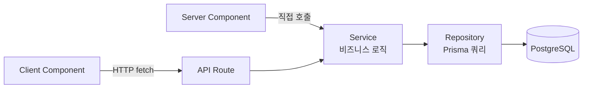
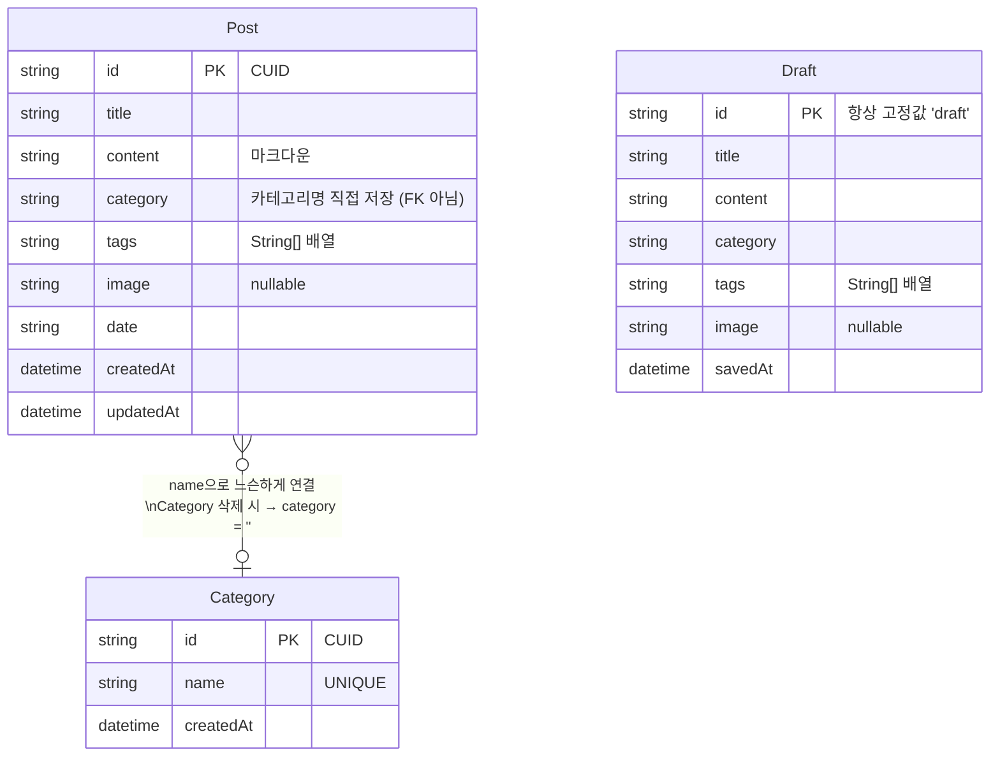
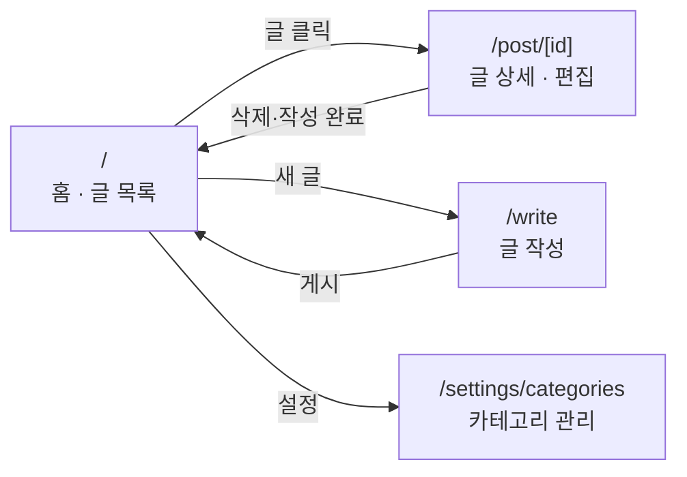
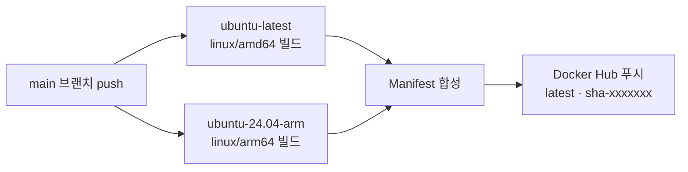
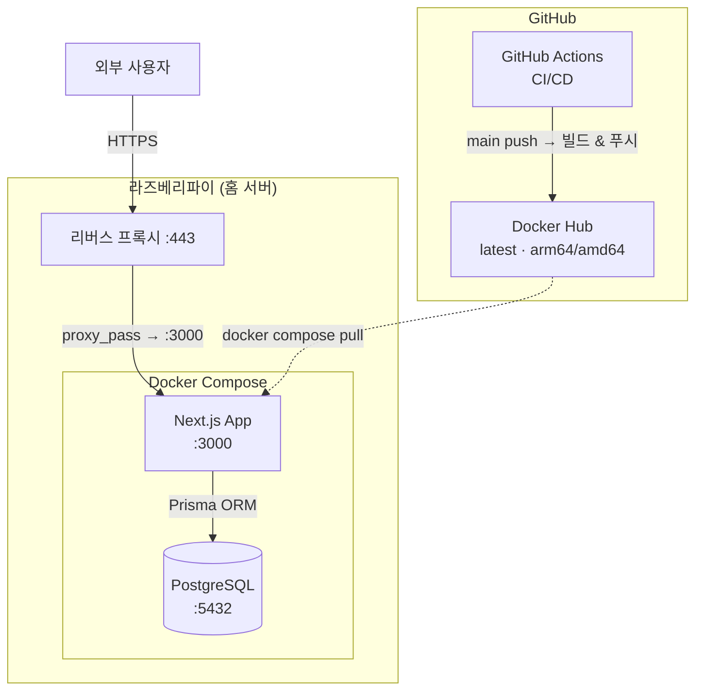

# RudyNote

배우고, 경험하고, 나누고 싶은 것들을 기록하는 개인 블로그.

## 기술 스택

| 분류 | 기술 |
|---|---|
| Framework | Next.js 16.2 (App Router) |
| UI | React 19, Tailwind CSS v4 |
| Editor | Milkdown Crepe v7 |
| ORM | Prisma v5 |
| Database | PostgreSQL 16 |
| Language | TypeScript 5 |
| Auth | Auth.js v5 (next-auth@beta) |
| Deployment | Docker, GitHub Actions |

---

## 아키텍처



---

## 백엔드 레이어 구조



| 레이어 | 위치 | 책임 |
|---|---|---|
| **Server Component** | `app/**/page.tsx` | Service 호출 → props 전달 |
| **Client Component** | `components/**` | UI 렌더링, API fetch, 상태 관리 |
| **API Route** | `app/api/**` | 요청 검증, Service 호출, revalidatePath |
| **Service** | `lib/services/**` | 비즈니스 로직, 에러 throw |
| **Repository** | `lib/repositories/**` | Prisma 쿼리, 날짜 포맷 변환 |

---

## API 엔드포인트

| Method | Path | 설명 |
|---|---|---|
| `GET` | `/api/posts` | 전체 글 목록 |
| `POST` | `/api/posts` | 글 생성 |
| `GET` | `/api/posts/:id` | 글 단건 조회 |
| `PUT` | `/api/posts/:id` | 글 수정 |
| `DELETE` | `/api/posts/:id` | 글 삭제 |
| `GET` | `/api/draft` | 임시저장 조회 |
| `PUT` | `/api/draft` | 임시저장 저장/갱신 |
| `DELETE` | `/api/draft` | 임시저장 삭제 |
| `GET` | `/api/categories` | 카테고리 목록 |
| `POST` | `/api/categories` | 카테고리 추가 |
| `DELETE` | `/api/categories/:id` | 카테고리 삭제 |

응답 형식: 성공 `{ data }` / 실패 `{ error: { code, message } }`

---

## 데이터 모델



---

## 페이지 구조



---

## 주요 기능

### 홈 레이아웃 (2컬럼)

데스크톱(`lg` 이상)에서 좌측 사이드바 + 우측 글 목록 구조:

- **프로필 카드** — 이름, 소개, GitHub · 이메일 링크 (클립보드 복사 버튼 포함), sticky 고정
- **통계 위젯** — 총 게시글 수 · 카테고리 수 · 태그 수 (추가 DB 쿼리 없이 홈 데이터 재사용)
- 모바일/태블릿에서는 사이드바 숨김, 단일 컬럼

### 글 목록

- 전체 글 서버사이드 로딩 후 클라이언트에서 필터링 (`useMemo`)
- 제목·본문·태그 통합 검색, 검색어 하이라이트
- 카테고리 필터, 태그 필터
- 작성 중인 임시저장 글이 있으면 상단 배너 표시

### 글 작성

- Milkdown 마크다운 에디터 (코드 하이라이트 포함)
- 제목, 카테고리, 날짜, 태그, 대표 이미지 설정
- **자동 임시저장** — 입력 후 2초 debounce로 `PUT /api/draft` 호출
- 페이지 재방문 시 임시저장 내용 자동 복원

### 글 상세

콘텐츠 순서 (위 → 아래):

1. 메타 정보 (카테고리 · 읽기 시간 · 제목 · 날짜 · 태그)
2. 본문 (Milkdown readonly 렌더링)
3. **공유 버튼** — URL 복사 · X · LinkedIn · Reddit (수정 모드에서 자동 숨김)
4. **관련 글** — 같은 카테고리 또는 태그 기준 최대 3편
5. 수정 · 삭제 버튼 (어드민 전용)

### 글 편집

- 수정 버튼 클릭 시 **인플레이스 편집** (페이지 이동 없음)
- 제목, 본문, 카테고리, 날짜, 태그 수정 → `PUT /api/posts/:id`
- 저장 실패 시 에러 메시지 표시

### 카테고리 관리

- 카테고리 추가 · 삭제
- 삭제 시 해당 카테고리를 사용 중인 글의 `category` 필드를 빈 문자열로 자동 초기화

---

## 로컬 개발

### 요구사항

- Node.js 20+
- PostgreSQL 실행 중

### 실행

```bash
# 1. 의존성 설치
npm install

# 2. 환경변수 설정
cp docker/.env.example .env.local
# .env.local 에서 DATABASE_URL, AUTH_SECRET, ADMIN_USERNAME, ADMIN_PASSWORD_HASH_B64 설정

# 3. DB 마이그레이션
npx prisma migrate dev

# 4. 개발 서버 시작
npm run dev
```

브라우저에서 `http://localhost:3000` 접속

### 환경변수

| 변수 | 설명 |
|---|---|
| `DATABASE_URL` | PostgreSQL 연결 문자열 |
| `AUTH_SECRET` | JWT 서명 시크릿 (32바이트 이상 랜덤값) |
| `ADMIN_USERNAME` | 관리자 로그인 ID |
| `ADMIN_PASSWORD_HASH_B64` | bcrypt 해시(cost=12)를 Base64 인코딩한 값 |
| `NEXT_PUBLIC_SITE_URL` | 운영 도메인 (SEO, sitemap 기준 URL) |

```bash
# AUTH_SECRET 생성
node -e "console.log(require('crypto').randomBytes(32).toString('base64'))"

# ADMIN_PASSWORD_HASH_B64 생성
node -e "const b=require('bcryptjs'); console.log(Buffer.from(b.hashSync('yourpassword',12)).toString('base64'))"
```

### 명령어

```bash
npm run dev                                  # 개발 서버 (Turbopack)
npm run build                                # 프로덕션 빌드
npm run lint                                 # ESLint 검사

npx prisma migrate dev --name <이름>         # 마이그레이션 생성 및 적용
npx prisma generate                          # Prisma 클라이언트 재생성
npx prisma studio                            # DB GUI
```

---

## Docker 배포

### 환경변수 설정

```bash
cp docker/.env.example docker/.env
# docker/.env 에서 각 변수 설정
```

### Docker Hub 이미지로 실행

```bash
cd docker
docker compose pull
docker compose up -d
```

컨테이너 시작 시 `prisma migrate deploy`가 자동 실행됩니다.

### 로컬 빌드로 실행

`docker-compose.yml`의 `image:` 줄을 `build: ..`으로 교체 후:

```bash
cd docker
docker compose up --build -d
```

---

## CI/CD

`main` 브랜치에 push하면 GitHub Actions가 자동으로 Docker Hub에 이미지를 빌드 & 푸시합니다.



**필요한 GitHub Repository Secrets**

| Secret | 값 |
|---|---|
| `DOCKERHUB_USERNAME` | Docker Hub 아이디 |
| `DOCKERHUB_TOKEN` | Docker Hub Access Token (Read & Write) |

---

## 인프라 구조

라즈베리파이 홈 서버에서 Docker Compose로 운영하며, Nginx가 외부 요청을 받아 Next.js 앱으로 전달합니다.



| 구성 요소 | 역할 |
|---|---|
| **Nginx** | 외부 80/443 포트 수신, TLS 종단, `proxy_pass`로 앱(:3000) 전달 |
| **Next.js App** | SSR/ISR 페이지, API Routes, Server Actions 처리 |
| **PostgreSQL** | 블로그 데이터 영구 저장, Docker 내부 네트워크로만 접근 |
| **GitHub Actions** | `main` push 시 멀티 아키텍처(amd64 · arm64) 이미지 빌드 & 푸시 |
| **Docker Hub** | 빌드된 이미지 저장소, 라즈베리파이에서 `pull`로 배포 |

---

## 프로젝트 구조

```
src/
├── app/
│   ├── layout.tsx                      # 루트 레이아웃, 공통 metadata · OG · Twitter
│   ├── page.tsx                        # 홈 (ISR revalidate: 0) — 2컬럼 레이아웃
│   ├── globals.css                     # Tailwind v4, Milkdown 스타일 오버라이드
│   ├── sitemap.ts                      # /sitemap.xml 동적 생성
│   ├── robots.ts                       # /robots.txt (/write, /settings 차단)
│   ├── api/
│   │   ├── posts/
│   │   │   ├── route.ts                # GET /api/posts, POST /api/posts
│   │   │   └── [id]/route.ts           # GET · PUT · DELETE /api/posts/:id
│   │   ├── draft/
│   │   │   └── route.ts                # GET · PUT · DELETE /api/draft
│   │   └── categories/
│   │       ├── route.ts                # GET /api/categories, POST /api/categories
│   │       └── [id]/route.ts           # DELETE /api/categories/:id
│   ├── post/[id]/
│   │   ├── page.tsx                    # 글 상세 (ISR + generateMetadata + React.cache)
│   │   └── PostDetailWrapper.tsx       # PostDetail dynamic import (ssr: false)
│   ├── write/
│   │   └── page.tsx                    # 글 작성 (force-dynamic)
│   └── settings/categories/
│       └── page.tsx                    # 카테고리 관리 (force-dynamic)
├── components/
│   ├── layout/
│   │   ├── Header.tsx                  # async Server Component, session-aware nav
│   │   ├── ProfileCard.tsx             # Client: 프로필 카드 (이름·소개·링크·복사 버튼)
│   │   └── StatsCard.tsx               # Server: 통계 위젯 (게시글·카테고리·태그 수)
│   ├── post/
│   │   ├── PostFeed.tsx                # Client: 검색·카테고리·태그 필터 (useMemo)
│   │   ├── PostList.tsx
│   │   ├── PostCard.tsx                # 검색어 하이라이트
│   │   ├── PostDetail.tsx              # 상세 뷰 + 인플레이스 편집
│   │   └── ShareButtons.tsx            # Client: URL 복사 · X · LinkedIn · Reddit 공유
│   ├── editor/
│   │   ├── MilkdownEditor.tsx          # Milkdown Crepe 래퍼 (ssr: false)
│   │   ├── WriteForm.tsx               # 작성 폼, 2초 debounce 자동 임시저장
│   │   └── DraftBanner.tsx             # 임시저장 존재 시 홈 상단 배너
│   ├── filter/
│   │   ├── SearchBar.tsx
│   │   ├── CategoryFilter.tsx
│   │   └── TagFilter.tsx
│   ├── settings/CategoryManager.tsx    # 카테고리 CRUD (API fetch 기반)
│   └── ui/
│       ├── Button.tsx                  # primary · secondary · danger
│       └── TagBadge.tsx
└── lib/
    ├── config.ts                       # 환경변수 중앙화 (config.site.url · config.admin.*)
    ├── auth.ts                         # requireAdminPage() — Server Action 인증 guard
    ├── db/index.ts                     # Prisma 싱글톤
    ├── api.ts                          # apiSuccess · apiError · handleError
    ├── errors.ts                       # NotFoundError · ConflictError · ValidationError
    ├── actions/
    │   └── posts.ts                    # createPost · deletePost (redirect 필요한 것만)
    ├── services/
    │   ├── postService.ts
    │   ├── draftService.ts
    │   └── categoryService.ts
    ├── repositories/
    │   ├── postRepository.ts           # Post Prisma 쿼리 + 날짜 변환
    │   ├── draftRepository.ts          # Draft Prisma 쿼리 + 날짜 변환
    │   └── categoryRepository.ts       # Category Prisma 쿼리 + clearPostCategory
    ├── readingTime.ts                  # readingTime() · summarize()
    └── highlight.ts                    # getHighlightParts()
```
