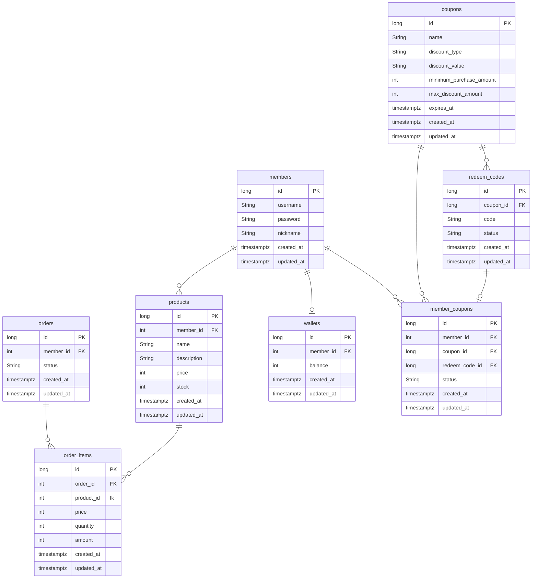

```mermaid
erDiagram

members{
  long id PK
  String username
  String password
  String nickname
  timestamptz created_at
  timestamptz updated_at
}

products{
  long id PK
  int member_id FK
  String name
  String description
  int price
  int stock
  timestamptz created_at
  timestamptz updated_at
}

orders{
  long id PK
  int member_id FK
  String status
  timestamptz created_at
  timestamptz updated_at
}

order_items{
  long id PK
  int order_id FK
  int product_id fk
  int price
  int quantity
  int amount
  timestamptz created_at
  timestamptz updated_at
}

wallets{
  long id PK
  int member_id FK
  int balance
  timestamptz created_at
  timestamptz updated_at 
}

coupons{
  long id PK
  String name
  String discount_type
  String discount_value
  int minimum_purchase_amount
  int max_discount_amount
  timestamptz expires_at
  timestamptz created_at
  timestamptz updated_at
}

member_coupons{
  long id PK
  int member_id FK
  long coupon_id FK
  long redeem_code_id FK
  String status
  timestamptz created_at
  timestamptz updated_at 
}

redeem_codes{
  long id PK
  long coupon_id FK
  String code
  String status
  timestamptz created_at
  timestamptz updated_at 
}

members ||--o{ products : ""
orders ||--o{ order_items : ""
products ||--o{ order_items : ""
members ||--o| wallets : ""
coupons ||--o{ redeem_codes : ""
members ||--o{ member_coupons : ""
coupons ||--o{ member_coupons : ""
redeem_codes ||--o| member_coupons : ""
```
